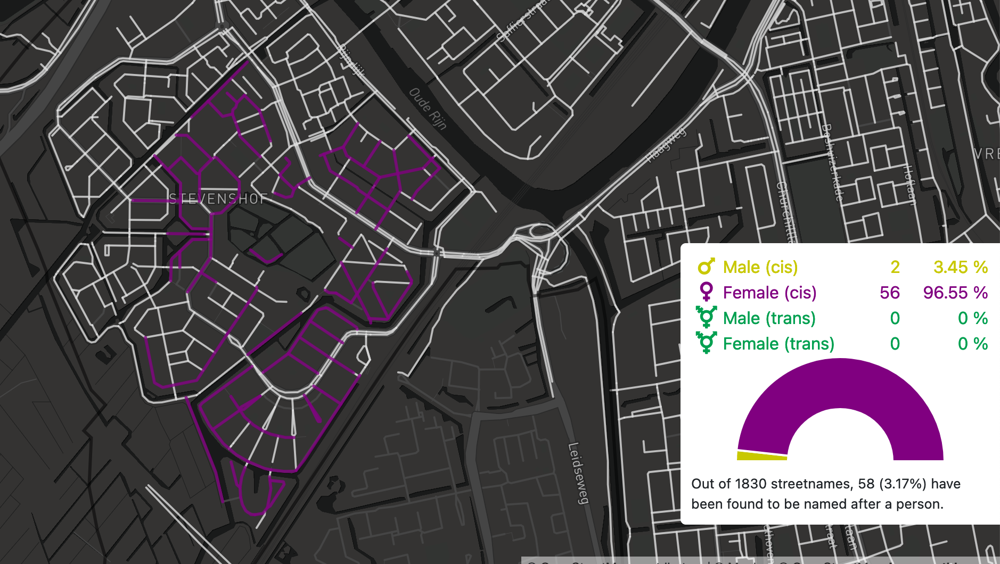

Sad state of affairs. Only 4 streets are mapped to wikidata!
But the <https://nl.wikipedia.org/wiki/Lijst_van_straten_in_Leiden> wiki page
has loads of etymology!

If you want to add to the data itself, you can map it on OpenStreetMap. You can use the tag name:etymology:wikidata for adding the information to a street using a Wikidata entity.

I've added a few etymology notes to Stevenshof

